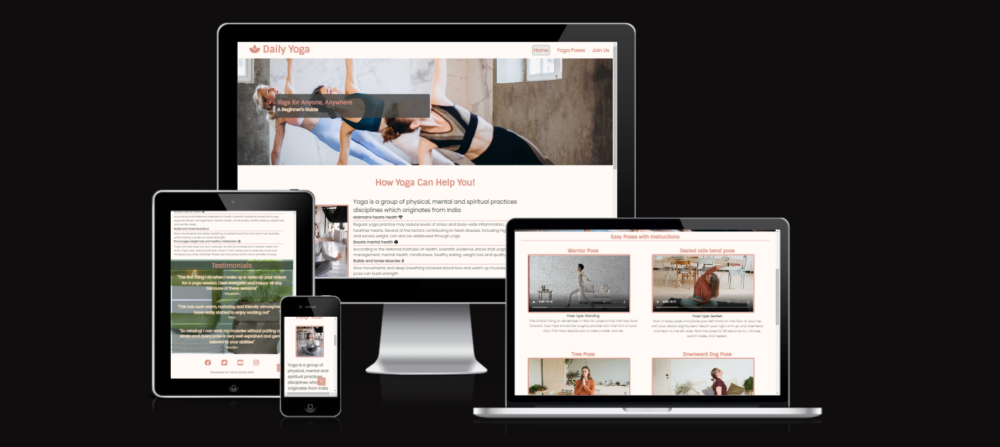

# Daily Yoga - Portfolio Project 1
This is a yoga exercise page which is beginner friendly yoga exercise page. It gives an insight into what yoga is and how it can have a positive effect on your mind and body.

The website has some yoga poses which lets the user try them out at home.

It also has a join us page which allows the user to  join our mailing list which informs them about the upcoming classes and gives some interesting yoga news!

The aim of the project is to build a responsive website using HTML and CSS.

[Live Link to the website](https://fatimaqais.github.io/daily-yoga/)

## __User Experience (UX) and Design__

### __User Stories__

- As a user, I would like to see what Yoga is and what it looks like which can be seen on the home page.
- As a user, I would like to see what people think about the exercise and see some reviews.
- As a user, I would like to see if I can try out the exercise and would also like a some instructions on how to do it.
- As a user, I would like to sign up for yoga classes and yoga related news and updates.

### __Color Scheme__

- The color scheme for this page was taken from [coolors](https://coolors.co/palette/fffaf5-95a78d-3a4336-d88f81).
Some colours were adjusted accordingly to improve visibility.

### __Typography__

- The font for this page was taken from [google fonts](https://fonts.google.com/)
    - The font Sintony was used for headings, whereas the body has the poppins font.

 

### __Wireframes__

- To check out the wireframes for this project, [click here](/WIREFRAMES.md) 

## __Features__

### Common Features

These features are on every page of the website for a consistent design

-__Logo and Navigation Bar__
- The logo can be clicked to bring you back to the home and the navigation menu takes you to the correct pages. This is responsive on every screen size. The logo has a simple design and the nave bar 

-__Main Image__
- The main image stays the same on every page however the size and aspect ratio changes depending on the screen size. It contains a text box which changes text for each page and displays a message on what the page is about.

-__Footer__
- The footer stays the same on every page however it does change shape and size for a responsive design for different devices. It has social media icons which open in a new tab.

-__Title icon__
- The title and the icon of the page shows what the site name and logo is. 

### Home Page
 Landing page for the site. Users will see the main image with cover text which shows what the site is about. By scrolling down they will see the about section and then the testimonial.

 

- __About__
    - This tells the user what yoga is and how it can benefit the users body and mind. On the right, is an image of a girl doing yoga.

- __Testimonials__
    - This contains testimonials from previous users who have tried the workout and left a positive review. This can help convince the users to try the exercise if they haven't done it before.

### Yoga Poses Page
This page includes videos for users who want to try out the exercise at home. It includes simple poses with instructions on how to do them.

- __Videos__
    - Videos are aligned in 2 columns with 3 rows, each row holds 2 videos and on smaller devices, the videos are aligned in the center individually.

### Join Us Page
This page allows the users to join our yoga group and select if they wish to work out in a group or by themselves.

- __Form__
    - The form asks the users to enter their name, email and choose an option for the type of workout they would like to do. When submitting details users are directed to a Thank you Page.

### Thank you Page
This page displays a thankyou message after the users have submitted their form. I has a button that takes the users back to the home page.

### Features Left to Implement
- I would like to add a pricing list page(subscription page) for users who wish to subscribe to a monthly or yearly yoga plan.

## __Technologies Used__

### Languages Used

- HTML and CSS were used to create this project.

### Frameworks, Libraries & Programs Used

- [Balsamiq](https://balsamiq.com/) was used to create the wireframes for this project.
- [Git](https://git-scm.com/) was used for version control.
- [Github](https://github.com/) was used to save and store project's code.
- [Google Fonts](https://fonts.google.com/) was used to import the fonts used on the website.
- [Font Awesome](https://fontawesome.com/) was used for the icons on this page.
- [Flaticon](https://www.flaticon.com/) was used to find the icon for the title.

## __Testing__

### User Testing

- After deploying the site, the website was checked by friends and family on different devices.

- The website works well on every other device and is responsive to different screen sizes.

- The site was tested on different browsers like Chrome, Edge and Firefox. The site had no issues across all browsers. 

- The footer links work perfectly and open on a new page.

- Once the form is submitted it displays a thank you message. The button on thank yo page also works fine and takes the users back to home page.

### Validator Testing

- HTML
    - No errors were found when passing the index.html page through the [W3C validator](https://validator.w3.org/nu/?showsource=yes&doc=https%3A%2F%2Ffatimaqais.github.io%2Fdaily-yoga%2Findex.html)

    - No errors were found when passing the yogaposes.html page through the validator [W3C valiadtor](https://validator.w3.org/nu/?showsource=yes&doc=https%3A%2F%2Ffatimaqais.github.io%2Fdaily-yoga%2Fyogaposes.html)

    - No errors were found when passing the joinus.html page through the validator [W3C validator](https://validator.w3.org/nu/?showsource=yes&doc=https%3A%2F%2Ffatimaqais.github.io%2Fdaily-yoga%2Fjoinus.html)

    - No errors were found when passing the thankyou.html page through the validator [W3C validator](https://validator.w3.org/nu/?showsource=yes&doc=https%3A%2F%2Ffatimaqais.github.io%2Fdaily-yoga%2Fthankyou.html)

- CSS 
    - No errors were found when passing through the official Jigsaw validator

### Performance and Accessibility Testing
The website was tested for performance and accessibilty using Lighthouse on google chrome's developer tools.

## __Deployement__

This website was deployed to GitHub Pages. The steps to deploy are:
- Log in to GitHub
- Go to the setting for this repository.
- Select pages in left hand navigation menu.
- From the source dropdown, select main branch and then press save.
- The site will be deployed now. It may take a few minutes to go live.

### Local Deployement
To fork this repository, follow these steps:
- Log in to GitHub
- Go to the repository, https://github.com/fatimaqais/daily-yoga
- On the top right corner, click on the button that says fork.

To clone this repository, copy the command below and paste it in your terminal:

- ` https://github.com/fatimaqais/daily-yoga.git `

## __Credits__

### Code
- The code for the footer was taken from [Code Institute's](https://codeinstitute.net/) Love running walkthrough project.
- The code idea for the nav bar was taken from the same above mentioned source. However, there are some style changes to suit my project. 

### Content
- Some of the techniques for yoga on the yoga poses page was taken from [Insiders health page](https://www.insider.com/guides/health/fitness/yoga-for-beginners)
- The information in the about section is taken from differeent websites after researching.
    - The first page where most of the information came form is [Hopkins Medicine](https://www.hopkinsmedicine.org/health/wellness-and-prevention/9-benefits-of-yoga)
    - Some informations were taken from [Everyday Health](https://www.everydayhealth.com/yoga/big-ways-yoga-can-help-with-your-weight-loss-goals/)

### Media
- All the images and videos were taken from [Pexels](https://www.pexels.com/).
- The title icon was taken from [flaticon](https://www.flaticon.com/)
- The icons for about section were taken from [Font Awesome](https://fontawesome.com/)