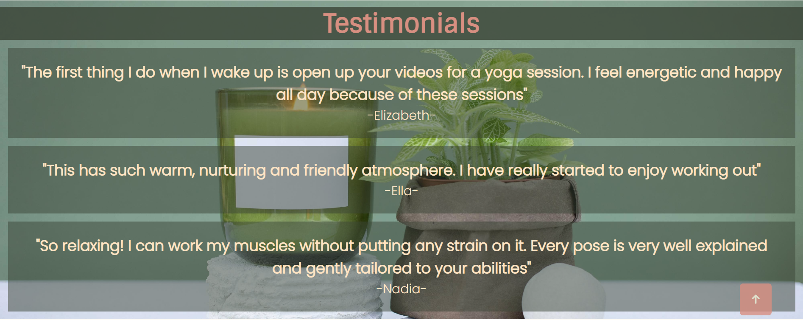

# Daily Yoga - Portfolio Project 1
This is a yoga exercise page which is beginner freindly and gives an insight to what yoga is and how it can have a positive affect on your mind and body.

The website has some yoga poses which lets the user try it out at home and then also has join us page which allows them to  join our mailing list which informs them about upcoming classes and some interesting yoga news!

[Live Link to the website](https://fatimaqais.github.io/daily-yoga/)

## Features

### Common Features

These features are on every page of the website for a consistent design

-__Logo and Navigation Bar__
- The logo can be clicked to bring you back to the home and the navigation menu takes you to the correct pages. This is responsive on every screen size. The logo has a simple design.

-__Main Image__
- The main image stays the same on every page however it adjusts size and changes aspect ratio depending on the screen size. It contains a text box which changes text for each page and displays message on what the page is about.

-__Footer__
- The footer stays the same on every page however it does change shape and size for a responsive design for differnt devices.

-__Title icon__
- The title and the icon of the page shows what the site name and logo is. 

### Home Page
 Landing page for the site. User will see the main image with cover text which shows what the site is about. and by scrolling down they will see the about section and then the testimonial.

 

-__About__
- This tells the user what yoga is and how it can benefit the users body and mind. On the right there is an image of a girl doing yoga to give a glance of what the workout looks like.

-__Testimonials__
- This contains statement from previous users who have tried the workout and left a positive review. This can help convince the users to  try out the exercise if they havent done it before.

### Yoga Poses Page
This page includes videos for users who want to try out the exercise at home. It includes simple poses with instructions on how to do it.

-__Videos__
- Videos are aligned in 2 columns with 3 rows, each row holds 2 videos and on smaller devices the videos are aligned in the center individually.

### Join Us Page
This page allows the user to join our yoga group and select if the wish to workout in a group or by themselves.

-__Form__
- The form asks the user to enter their name, email and choose an option for the type fo workout they would like to do. When submiting details users are directed to a Thank you Page.

### Features Left to Implement
- I would like to add a pricing list page(subscription page) for users who wish to subscribe to a monthly or yearly yoga plan. 
