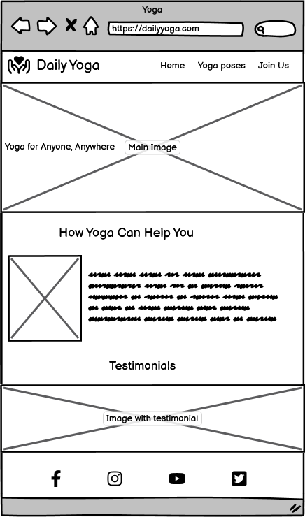
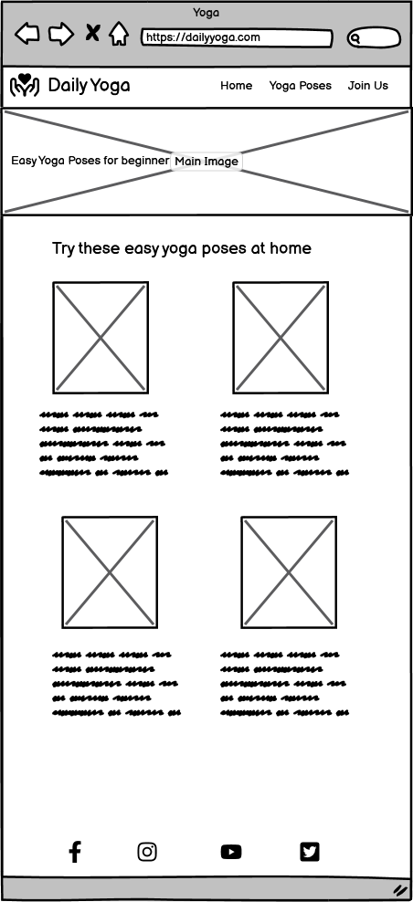
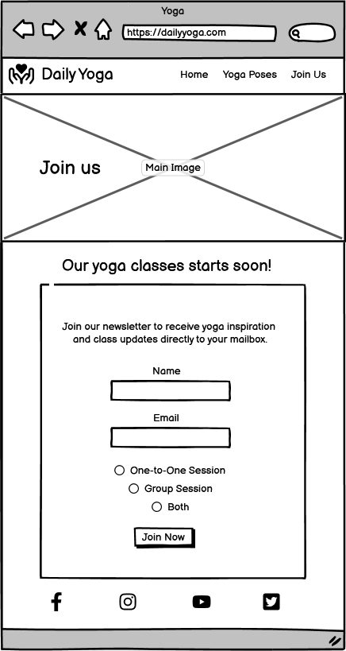
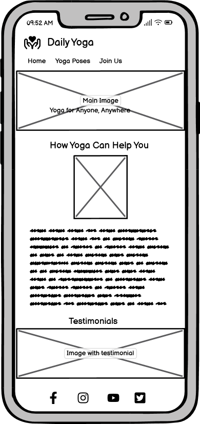
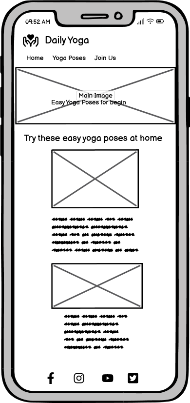
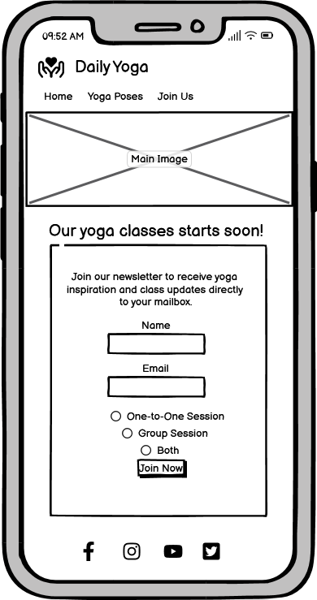

### __Wireframes__
Balsamiq was used to create the wireframe of the page as the first step for this project. I planned the layout for the page on destop device and mobile device.

-__Desktop WireFrames__
    - Home Page

    - Yoga Poses Page

    - Join Us Page

-__Mobile Wireframes__

- Home Page

- Yoga poses page

- Join us page

On the webpage the radio check buttons are on the right side instead of the left.

